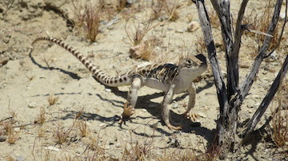

```{r setup, include=FALSE}
knitr::opts_chunk$set(echo = TRUE)
#libraries####
library(tidyverse)
library(ResourceSelection)
#library(broom)
```

<br>

## Resource selection function  

  
<br>

All data aggregated but two different fundamental assumption sets depending on how constraints associated with unused points.  Unused can be fully randomly sampled, i.e. could in theory overlap with potential animal relocation at a different point in space or time.  Alternatively, unused points sampled from environment can be constrainted to ensure that they never overlap with another relocation instance.

<br>

## Models      
```{r, rsf key groupings, warning=FALSE, message=FALSE}
#data with replace means can overlap (same assumption as work in Carrizo)
#data <- read_csv("data/data_with_replace.csv")
data <- read_csv("data/tidy_data.csv") 
data <- data %>%
  select(rep, status, year, ground, mesohabitat, Aspect, Slope, Elev, KDF, Shrub_Cov, NDVI, Solar, aspect.cat)
data$year <-  as.character(data$year)
data


#function
#global availability (m=0) and bootstrap (B=99)
# m = 0 indicates sample from anywhere in dataframe versus structure or blocks
model.rspf <- function(x) {rspf(status ~ Shrub_Cov + NDVI + Slope + Elev + Aspect + Solar, x, m=0, B = 99, model = TRUE)
}

m7 <- model.rspf(data)
summary(m7)
plot(m7)
mep(m7) # marginal effects similar to plot but with CIs
kdepairs(m7) # 2D kernel density estimates

#split-map to explore key levels####
#year####
m.year <- data %>% 
  split(.$year) %>% 
  map(~ model.rspf(.))
m.year


#ground####
m.ground <- data %>% 
  split(.$ground) %>% 
  map(~ model.rspf(.))
m.ground

#mesohabitat
m.meso <- data %>% 
  split(.$mesohabitat) %>% 
  map(~ model.rspf(.))
m.meso

```

## Effect size estimate  
A few instances in literature calculate log odds ratio to estimate effect sizes.  Contrast of used by unused probabilities.  
```{r, effect sizes, warning=FALSE, message=FALSE}
#build dataframe
#model <- as_tibble(m7$model)
#fitted_values <- as_tibble(m7$fitted.values)
#odds <- bind_cols(model, fitted_values)
#odds
#write_csv(odds, "data/odds.csv")
#library(esc)
#effect_sizes(odds, t = value, fun = "esc_bin_prop", es.type = "or")

#just to run this section only
library(tidyverse)
#library(scales)
#odds <- read_csv("data/odds.csv")

#log odds ratios####
#log(p(A),p(not-A)) typically for A as event or cell frequency
#log((p1/(1-p1))/(p2/(1-p2))) for proportion successful in each group

odds_df <- read_csv("data/log_odds.csv") %>%
  select(-aspect)

odds_df_long <- odds_df %>%
  gather(factor, measure, 1:5)

ggplot(odds_df_long, aes(measure, log_odds)) +
  geom_smooth(method = lm, color = "darkgreen") +
  facet_wrap(~factor, scales = "free") +
  labs(x = "", y = "log odds ratio")

library(broom)
m <- odds_df_long %>%
  group_by(factor) %>%
  do(fit = lm(log_odds~measure, data =.)) 
tidy(m, fit)

```


## Interpretations  
1. No difference between overlapping and non-overlapping unused sample points (EDA).  
2. Best models include all key environnmental drivers.  
3. Shrub cover, NDVI, and solar all have positive effects on probability of sampling animals.  
4. Aspect is not statistically significant (and is redundant with solar exposure effects).  
5. Increasing elevation decreasses likelihood of sampling animals.  
6. The relative importance of different drivers can vary annually but were consistent in general effects.  
7. Shrub cover predicted probabilities above and below ground.  
8. Shrub cover (downscaled data) as a predictor was more important for shrub relocations confirming data derivation process.  

