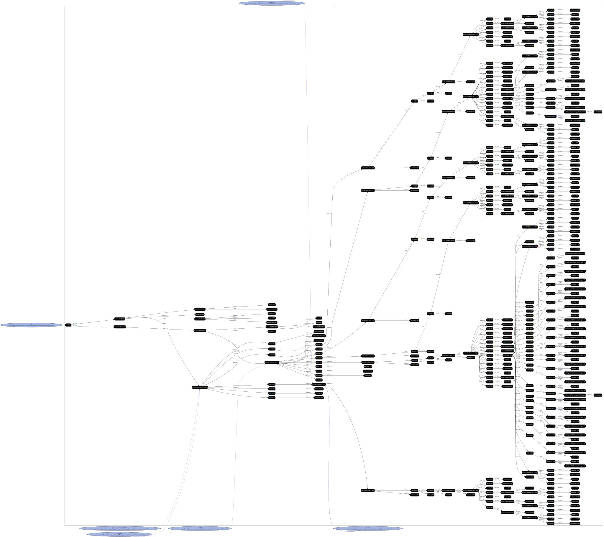
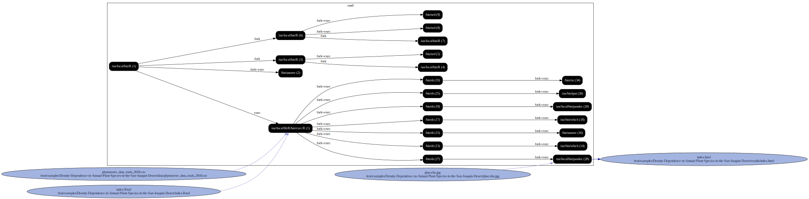

### A test for density dependence in monocultures   of native California annual seeds.

### Structure

`experiment/`: Holds the R scripts, data, and driver

`with-driver`: Holds output from a reprozip run that used the `run.sh` driver

`without-driver`: Holds output from a reprozip run that didn't use the `run.sh` driver

### What the experiment does

The experiment runs the single `Rmd`, which reads `data/phytometer_data_trials_2018.csv`. It uses `phacelia.jpg` when rendering `results/index.html`.

## Running with Sciunit

```
sciunit open Density-Dependence-in-Annual-Plant-Species-in-the-San-Joaquin-Desert.zip

sciunit repeat e1

```

### Graphs

With Driver:



Without Driver:


