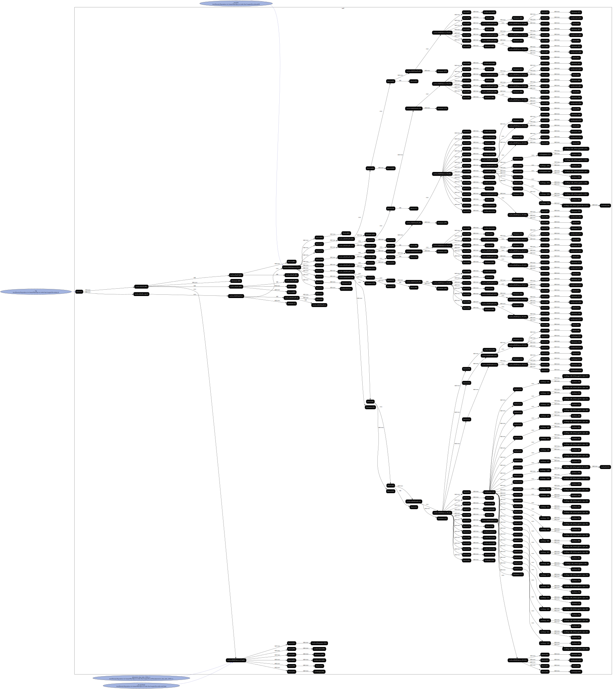

### A test for density dependence in monocultures   of native California annual seeds.

#### Instructions

Navigate to the `Density-Dependence-in-Annual-Plant-Species-in-the-San-Joaquin-Desert` folder and run the following commands

```
reprozip trace sh run.sh

reprozip pack Density-Dependence

reprounzip graph --processes process --packages drop --otherfiles io --regex-filter ^/etc graphfile.dot Density-Dependence.rpz

dot -Tsvg graphfile.dot -o graph.svg
```


#### Execution Flow
`run.sh` runs `jb-code.Rmd` which uses `phytometer_data_trials_2018.csv` to produce `index.html`.


#### Graphs


