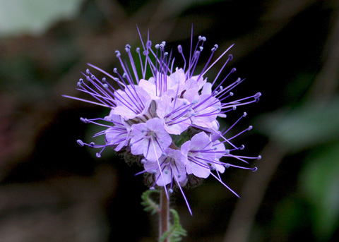

---
title:
author: "cjlortie"
date: "2018"
output:
  html_document:
    theme: lumen
    toc: yes
    toc_depth: 3
    toc_float: yes
  pdf_document:
    toc: yes
---
##Phytometer density series trials  
<br>

###Purpose
To explore the importance of intraspecific density dependence in annual plant species in the San Joaquin Desert.


<br>


<br>
[ecoblender](http://ecoblender.org)

###Data
```{r, data, warning=FALSE, message=FALSE}
library(tidyverse)
data <- read_csv("./data/phytometer_data_trials_2018.csv")
data <- data %>%
  mutate(proportion = plant.density/seed.density*100)

establishment <- data %>%
  filter(census == 2)
  
#established.density <- establishment$plant.density
#need to calculate proportion survival - from those that germinated - ie plant-plant data
final <- data %>%
  filter(census == 3) 

```

###Viz  
```{r, viz, warning=FALSE, message=FALSE}

#density curves
#density dependence is only when curves are non-linear
ggplot(data, aes(seed.density, plant.density, color = as.character(census))) +
  geom_smooth(se = FALSE) +
  facet_wrap(~treatment*species) +
  labs(color = "census", x = "seed density", y = "plant density")

#density dependence here is when curves have slopes significantly different from 1
ggplot(data, aes(seed.density, proportion, color = as.character(census))) +
  geom_smooth(se = FALSE) +
  facet_wrap(~treatment*species) +
  labs(color = "census", x = "seed density", y = "proportion plant emergence")

#then add contrasts for species

#check performance measures too

```

###Models
Examine differences between species in general.
Formally test for density dependence.
Explore sensitivity of performance measures.


###Interpretations
1. Is there density dependence?
2. Specific specificity
3. Measures
 