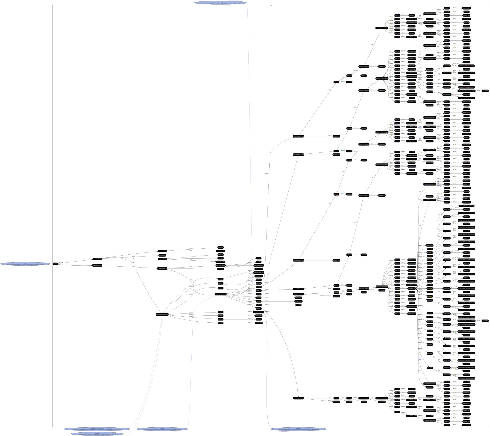

`with-driver`: Holds output from a reprozip run that used the `run.sh` driver

`without-driver`: Holds output from a reprozip run that didn't use the `run.sh` driver

### Graphs

With Driver:

Without Driver:

