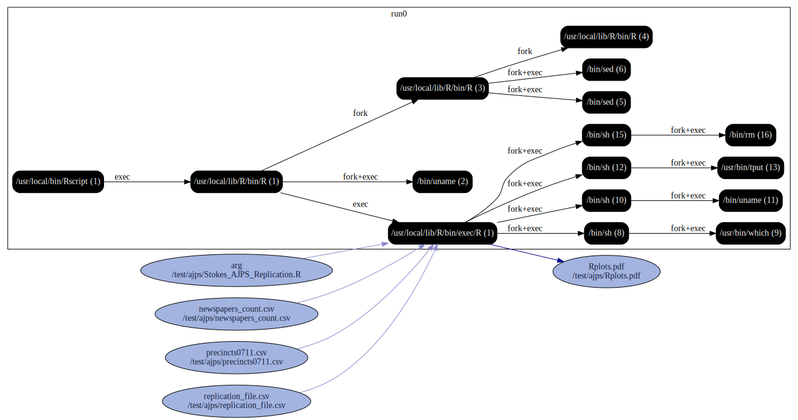

# AJPS example

Real-world single-step Rscript with inputs and output
```
reprozip trace Rscript Stokes_AJPS_Replication.R
reprozip pack ajps
reprounzip graph --processes process --packages drop --otherfiles io --regex-filter ^/etc graphfile.dot ajps.rpz
dot -Tsvg graphfile.dot -o graph.svg
```


