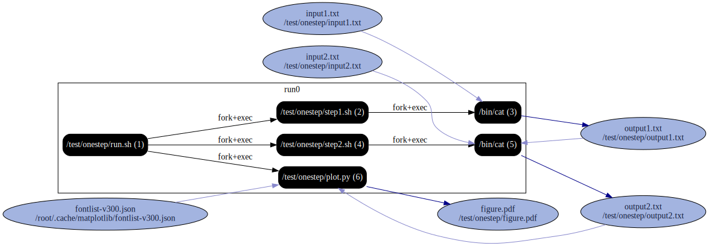

# Onestep example

Runs three separate very simple scripts (bash, bash, python) via a master script.

```
reprozip trace ./run.sh
reprozip pack onestep

reprounzip graph --processes process --packages drop --otherfiles io --regex-filter ^/etc graphfile.dot onestep.rpz
dot -Tsvg graphfile.dot -o graph.svg
```


