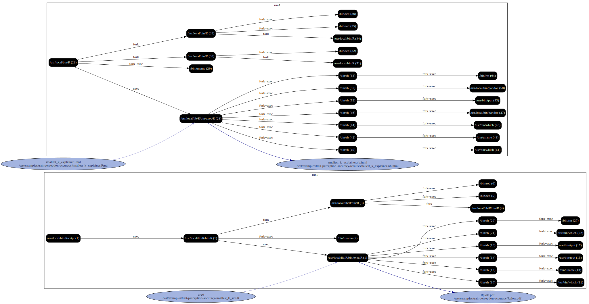

#### Instructions

Navigate to the `trait-perception-accuracy` folder and run the following commands


```
Rscript install.R

reprozip trace Rscript smallest_k_sim.R

reprozip trace --continue R -e "rmarkdown::render('smallest_k_explainer.Rmd', output_dir = 'results/')"

reprozip pack smallest-k

reprounzip graph --processes process --packages drop --otherfiles io --regex-filter ^/etc graphfile.dot smallest-k.rpz

dot -Tsvg graphfile.dot -o graph.svg
```


#### Graphs


