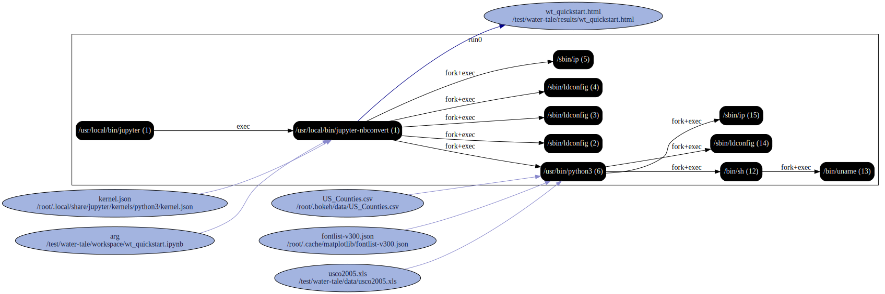

# Water tale

Trace execution of `nbconvert` on a notebook.

```
reprozip trace  jupyter nbconvert   --ExecutePreprocessor.allow_errors=True   --ExecutePreprocessor.timeout=-1   --FilesWriter.build_directory=./results   --execute workspace/wt_quickstart.ipynb

reprozip pack watertale

reprounzip graph --processes process --packages drop --otherfiles io --regex-filter ^/etc graphfile.dot watertale.rpzk

```


